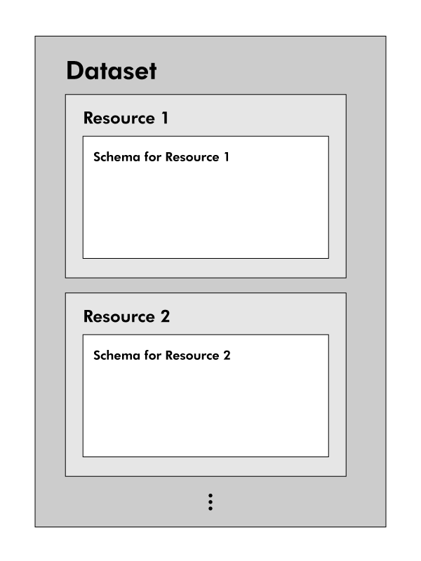

# Data.gov.sg Metadata Specifications

## Purpose of document 

The **Data.gov.sg** Data Package is based on the protocol proposed by [Open Knowledge International]().

The adoption of the "tidy", machine readable format for data files on **Data.gov.sg** requires metadata to be excluded in the data files. The Open Knowledge International protocol provides a neat solution to packaging metadata with tidy, reusable datasets. 

This document explains the structure of metadata for datasets on **Data.gov.sg** and what each element means. 

Each resource download contains the following in a zip file:

1. Data file(s) in CSV, SHP or KML format
2. Metadata text file in [YAML](http://yaml.org) (See [sample](./sample.txt))

The plain text version of the metadata is based on YAML, a format that is both human- and machine-readable. 

>*See our [Data Quality Guide](https://github.com/datagovsg/data-quality) for details on the requirements for tabular data.*

---

## Notes

### Metadata Structure
There are 3 levels of metadata required for the new data.gov.sg:

1. Dataset metadata
    - This is the general metadata for a dataset, which includes information such as category, publishing agency, and frequency of updates.
2. Resource metadata
    - A dataset may have multiple resources. Each resource has a unique title, last updated date, and footnotes that are specific to it.
3. Schema
    - This defines the characteristics of each column in a resource file, such as variable type, format and footnotes (where applicable).

### Quick Note on Capitalisation
For easy reading, all words in titles and unit of measure should be capitalised, with the following exceptions: 

1. Short Forms: All letters should be capitalised.
2. Conjunections: These are words such as *and*, *that* and *since*. Always in lower case.
3. Prepositions: These are words such as *by*, *at* and *for*. Always in lower case.

Example:
*Population by Age and Ethnic Group*

### Required Fields

The Input and Required? columns in Sections 1, 2 and 3 indicate what is required of agency administrators. 

#### Input
This states whether a field will be filled in automatically or requires user input:

| Value | Description                                                                  |
|-------|------------------------------------------------------------------------------|
| Auto  | Fully generated by system. No user input necessary.                          |
| User  | User input only.                                                             |
| Mixed | Partially generated by system. Users are allowed to add in additional input. |

#### Requirement
States whether a metadata field must be filled in. Represented as **Req** in short.

| Value | Description                                                   |
|-------|---------------------------------------------------------------|
| O     | Compulsory                                                    |
| △     |Compulsory in some cases specified in the description/remarks. |
| X     | Optional                                                      |

---

## 1. General Metadata for Each Dataset

This is the metadata that applies to all CSV resources in one dataset.

| Field | Description | Input | Required? |
|-------|-------------|-------|-----------|
| `Identifier` | An unique id number that is generated by the backend to identify each dataset. | Auto | O |
| `Name` | Name of data package file  *e.g. "population-by-age-group"* | Auto | O |
| `Title` | Name of dataset. The general structure of the name should be "what we are describing" by "dimension".  *e.g. "Population by Age Group"* | User | O |
|`Description` | Description of dataset, such as what is being measured, how the data is collected and what it shows. | User | O |
|`Topic` | One or more from this list: <ul><li>Economy</li><li>Education</li><li>Environment</li><li>Finance</li><li>Health</li><li>Infrastructure</li><li>Society</li><li>Technology</li><li>Transport</li></ul> Please see the [Reference Table for Topics](./topic_reference.md) to see how this has been streamlined from the old **Data.gov.sg**. |User | O |
|`Keywords` | Additional keywords for dataset for search functionality. Only nouns of 1 to 2 words should be used. May contain words from title of dataset but not the entire title.  The `topic` keywords should not be repeated here. In other words, tags should be more specific than topic words.  General tips: <ul><li>Include 2 to 3 tags for each dataset</li><li>Shorter tags are preferable</li><li>Terms used should be broad but useful. For example, "Singapore" is a redundant tag</li><li>Avoid terms that are so specific that they refer to a few datasets</li></ul> |User | O |
| `Publisher` | Agency publishing the dataset. | User | O |
| `Admin 1` | Main contact person for dataset. There are 3 sub-fields: <ul><li>name</li><li>department</li><li>email</li></ul> Note: This is only for internal reference. All public queries on datasets should be directed to [feedback@data.gov.sg](mailto:feedback@data.gov.sg). | User | O |
| `Admin 2` | Optional field. Second contact person for dataset. There are 3 sub-fields: <ul><li>name</li><li>department</li><li>email</li></ul> Note: This is only for internal reference. All public queries on datasets should be directed to [feedback@data.gov.sg](mailto:feedback@data.gov.sg). | User | X  |
| `Source` | Agency owning the dataset. This could be the same as publisher.   Multiple entries are allowed for cases where dataset is compiled from multiple agencies.  | User | O   |
| `Source URL` | Optional field for URL of agency's own data repository for corresponding dataset and/or associated report. | User | X |
|`License` | The use of all Singapore government open datasets is governed by the [Open Data Licence](https://data.gov.sg/terms). | Auto | O |
|`Frequency` | One of the following: <ul><li>Annual</li><li>Half-yearly</li><li>Quarterly</li><li>Monthly</li><li>Weekly</li><li>Daily</li><li>Real-time</li><li>Ad-hoc</li><li>Other (User must specify)</li></ul> | User | O |
| `Coverage` | The time period covered by the dataset. For real-time data, the end-date will be the date of the latest update.   Expressed in the form: "YYYY-MM-DD to YYYY-MM-DD" | Auto | O |
| `Last updated` | In the ISO 8601 format YYYY-MM-DD. | Auto | O |
| `Resources` | See next section [Metadata for Resources](#2_metadata_for_resources) for details. | User | O |

---

## 2. Metadata for Resources

Each table resource has its own set of metadata, such as title and a schema. Some fields are optional.

| Field | Description | Input | Required? |
|-------|-------------|-------|-----------|
| `Identifier` | An unique id number that is generated by the backend to identify each resource. | Auto | O |
| `Name` | The name of the CSV file.  *e.g. "population_by_age_group.csv"* | Auto | O |
| `Title` | The human-readable title for the resource. If there is only one resource, this is usually the same as the Dataset title.  e.g. *"Population by Age Group"* | User | O |
| `URL` | URL of this data resource on data.gov.sg. | Auto | O |
| `Format` | Refers to file format.  *e.g. "csv"* | Auto | O |
| `Description` | Optional field for footnotes specific to this resource. Each resource file may have multiple lines of description. | User | X |
| `Last Updated` | In the ISO 8601 format YYYY-MM-DD. | Auto | O |
| `Schema` | See next section [Metadata for Schema](#3_metadata_for_schema) for details. | Auto | O |

---

## 3. Metadata for Schema
The schema is a part of the metadata for each CSV resource, which provides details on each column in the table.

| Field | Description | Input | Required |
|-------|-------------|-------|----------|
| `Name` | This must correspond to the unique column header in the data file. It is case-sensitive. | Auto | O |
| `Title` | The human-readable title of the column. | User | O |
| `Type` | Data type. See next section **Data Types** for the full listing.   Note: Some variables represented as numbers, such as telephone numbers and postal codes, are classified as strings, not numeric variables, as they are not quantitative in nature. | User | O |
| `Sub Type` | Data sub-type. This is dependent on the type field. See next section [Data Types](#4_data_types) for the full listing of data sub-types used. | User | O |
| `Description` | Each variable may have multiple lines of description. Each footnote should be entered as a separate line under this item.   Some data types and subtypes require specific descriptions: <ul><li>Numeric (Percentage)</li><li>Datetime (Financial year/half/quarter)</li></ul> | User | △ |
| `Unit of Measure` | Compulsory for `numeric (general)` variables.   If the  column contain counts, the common form is "No. of [object]s", such as `No. of Students`.   For monetary values, we use `S$` as the unit of measurement. If the amount is in thousands, millions or billions, we use `S$ Thousand/Million/Billion`. For indices, we use `Index` as the unit of measurement.   For other numeric variables that are not counts, we use an appropriate generic measure such as `Ratio`. | User | △ |
| `Format` | Compulsory for all `datetime` types. This is automatically generated for `date`, `date_time` and `time` sub types. For example, the format for a *month* column will be *yyyy-mm*. | Auto | △ |
| `Coordinate System` | Compulsory for `location` types. | Auto | △ |

---

## 4. Data Types
Data administrators will need to specify the types and sub-types for each data field in the Schema. Only types discovered by the validation tool can be selected. 

If the chosen type/sub-type is not applicable to the entire column, an error message will be shown. 

| Type | Sub-Type | Description |
|------|----------|-------------|
| `string` | `general` | No specific format or feature. This applies to variables such as names, categories and sub-categories. |
| | `address` | No specific format requirements, but required for visualisation tools. |
| | `postal_code` | All postal codes must be 6-digit numbers. |
| | `email` | Email addresses must be in the form local@domain. e.g. john@email.com |
| | `telephone_numbers` | Telephone numbers will normally be detected as numeric unless non-numeric characters are included. Please take note to change the data type to this instead. |
| `numeric`| `general` | Non-percentages are all of this sub-type.   Note that the `Unit of Measure` field in the schema is compulsory for this sub-type. |
| | `percentage` | Percentages are stored as a fraction of 1 or 100. For example, 1% can be stored as 0.01 either 1. This must be specified by the user.   The following will be automatically be appended to the description field of the Schema if this sub-type is chosen:   "Percentages are expressed as number out of 1; i.e. 0.01 means 1%."  *or*  "Percentages are expressed as a number out of 100; i.e. 0.01 means 0.01%." |
| `datetime` | `year` | Format: YYYY |
| | `month` | Format: YYYY-MM
| | `date` | Format: YYYY-MM-DD |
| | `week` | Format: YYYY-[W]WW   If a special week system (e.g. US CDC Epidemiological Week) is used, this must be specified in the description field of the Schema. |
| | `quarter` | Format: YYYY-[Q]Q |
| | `half_year` | Format: YYYY-[H]H |
| | `financial_year` | Format: YYYY   Start and end dates of financial year must be specified in the description field of the Schema. |
| | `financial_half_year` | Format: YYYY-[H]H   Start and end dates of financial year must be specified in the description field of the Schema. |
| | `financial_quarter` | Format: YYYY-[Q]Q   Start and end dates of financial year must be specified in the description field of the Schema. |
| | `date_time` | Format (one of the following):  <ul><li>YYYY-MM-DD[T]hh:mm</li><li>YYYY-MM-DD[T]hh:mm:ss</li><li>YYYY-MM-DD[T]hh:mm+hh:mm</li><li>YYYY-MM-DD[T]hh:mm:ss+hh:mm</li></ul> |
| | `time` | Format (one of the following):  <ul><li>hh:mm</li><li>hh:mm:ss</li></ul> |
| `geo_coordinate` | `latitude` | Lower limit: 103.59  Upper limit: 104.07 |
| | `longitude` | Lower limit: 1.13  Upper limit: 1.47 |
| | `x` | Lower limit: 919.05  Upper limit: 54338.72 |
| | `y` | Lower limit: 12576.34  Upper limit: 50172.05 |

---

### Contact us

We will continue to review our Metadata Specifications to ensure that we meet the needs of our users.

We welcome all feedback to improve the quality of data published on Data.gov.sg. Raise an issue on Github or drop us an email at [feedback@data.gov.sg](mailto:data.gov.sg) if you have any comments or queries on the guide.

